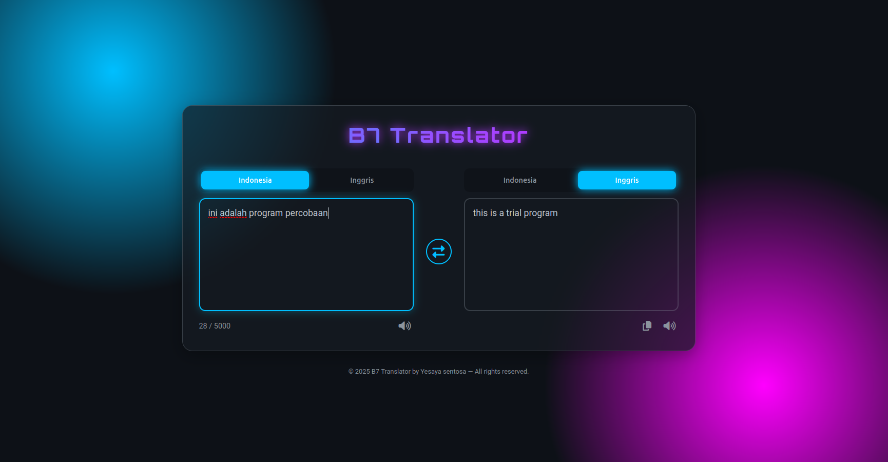

# B7 Translator

B7 Translator adalah aplikasi web sederhana untuk menerjemahkan teks secara otomatis antara Bahasa Indonesia dan Bahasa Inggris menggunakan FastAPI dan model AI dari OpenRouter.

## Fitur
- Terjemahan otomatis Indonesia ↔ Inggris
- Antarmuka web modern dan responsif
- Dukungan suara (Text-to-Speech) dan salin hasil
- API backend berbasis FastAPI

## Demo Tampilan
 <!-- Ganti dengan screenshot jika ada -->

## Cara Instalasi & Menjalankan

### 1. Clone Repository
```
git clone https://github.com/username/b7-translator.git
cd b7-translator
```

### 2. Buat & Aktifkan Virtual Environment (Opsional tapi disarankan)
```
python -m venv venv
source venv/bin/activate  # Linux/Mac
venv\Scripts\activate    # Windows
```

### 3. Install Dependensi
```
pip install -r requirements.txt
```

### 4. Konfigurasi API Key
Buat file `.env` di root folder, lalu isi dengan:
```
OPENROUTER_API_KEY=your_openrouter_api_key
```
Ganti `your_openrouter_api_key` dengan API key dari [OpenRouter](https://openrouter.ai/).

### 5. Jalankan Backend FastAPI
```
uvicorn main:app --reload
```
Akses API di: http://localhost:8000

### 6. Jalankan Frontend
Cukup buka file `index.html` di browser Anda.

## Struktur Folder
```
├── main.py           # Backend FastAPI
├── index.html        # Frontend web
├── script.js         # Script frontend
├── requirements.txt  # Daftar dependensi Python
├── .env              # File environment
└── readme.md         # Dokumentasi
```

## API Endpoint
- `POST /api/chat` — Kirim teks untuk diterjemahkan
  - Body JSON: `{ "text": "teks yang ingin diterjemahkan" }`
  - Response: `{ "reply": "hasil terjemahan" }`

## Catatan Penting
- Anda membutuhkan API key dari OpenRouter untuk menjalankan backend.
- Untuk penggunaan publik, pastikan API key Anda aman dan tidak dibagikan.


---

> Dibuat dengan ❤️ oleh B7 Translator Team

